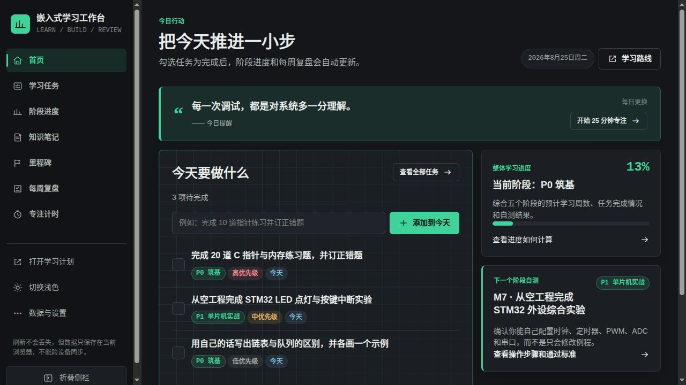
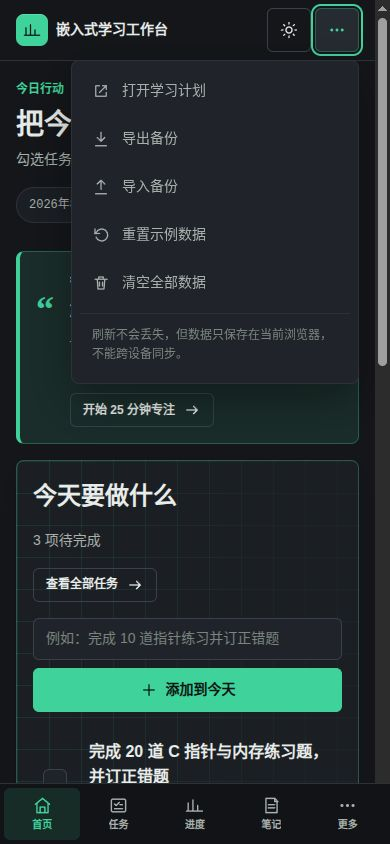

# 嵌入式学习工作台

一个配合《嵌入式学习计划》使用的本地优先学习管理工作台，面向希望系统学习嵌入式软件开发的自动化专业学生。

## About

工作台把 12–18 个月的学习路线拆成可以每天执行和每周复盘的任务，覆盖：

- C 语言、数据结构与电路基础
- 51 单片机与 STM32 外设开发
- FreeRTOS 与嵌入式 C 工程化
- 嵌入式 Linux 应用与驱动方向
- 工程拓展、综合项目、竞赛与求职准备

## 功能

- **首页**：今日与逾期任务、整体学习进度、下一个阶段自测和快速记录
- **学习任务**：计划日期、优先级、所属阶段、完成状态和多条件筛选
- **阶段进度**：解释进度含义与算法，根据任务和里程碑自动计算，也可以手动设置
- **知识笔记**：分类和所属阶段独立设置，支持筛选与编辑
- **里程碑自测**：M2、M7、M9、M13、M18 的操作步骤和可验证通过标准
- **每周复盘**：可带入本周完成任务，每周只保留一条复盘
- **番茄钟**：专注 25 分钟、短休息 5 分钟、长休息 15 分钟，支持开始、暂停、重置和刷新后继续
- **每日名言**：首页首屏按日期更换激励文案，并可直接进入番茄钟
- **数据备份**：支持将全部工作台数据导出为 JSON，并在浏览器中恢复
- **响应式界面**：支持桌面侧栏、平板图标栏和手机四入口加“更多”导航
- **深浅主题**：默认深色专注主题，可一键切换浅色主题

## 使用

直接打开 [`index.html`](./index.html) 即可使用，也可以访问在线版本：

<https://junhua-ecjtu.github.io/embedded-learning-workbench/>

工作台中的“学习路线”入口会打开 [`嵌入式学习计划.html`](./嵌入式学习计划.html)。

### 快速上手

1. 打开首页，在“今日任务”输入今天准备完成的学习动作，按回车或点击“添加任务”。
2. 用复选框标记完成；任务可以设置计划日期、优先级和所属阶段，也可以按日期范围筛选。
3. 进入“阶段进度”查看任务与里程碑形成的进度依据；需要时切换为手动设置，并记录接下来马上能执行的一项行动。
4. 在“知识笔记”中分别选择分类和所属阶段，记录一个结论、实验现象或易错点。
5. 到达 M2、M7、M9、M13、M18 时，按里程碑页面的三步操作完成实验；逐条满足通过标准后再标记通过。
6. 每周结束进入“每周复盘”，带入本周完成任务，再填写阻塞点和下周调整。
7. 需要集中学习时打开“番茄钟”，选择专注或休息时长，开始后只处理一项任务。
8. 定期从“数据与设置”导出 JSON 备份；更换浏览器前可用备份恢复。

### 页面示意

桌面首页集中展示今天要做的事、五阶段总进度和下一个里程碑：

手机端通过四个主入口和“更多”菜单切换页面，右上角设置菜单可以备份、恢复或管理数据：

截图来自当前版本，实际数据和主题状态会保存在你的浏览器中。

## 数据说明

- 数据通过浏览器 `localStorage` 保存在当前设备和当前浏览器中。
- 刷新或关闭页面不会丢失数据。
- 数据不会自动上传，也不能跨设备同步。
- 可以手动导出 JSON 文件备份全部数据，并在其他浏览器导入恢复。
- 番茄钟的当前模式、剩余时间和已完成专注回合也保存在当前浏览器中。
- 侧栏或手机端设置菜单可以重置示例数据或清空全部工作台数据。

## 文件

- `index.html`：学习工作台主页面
- `嵌入式学习计划.html`：完整的嵌入式学习路线与参考资料页面

## 部署

本项目是纯 HTML、CSS 和原生 JavaScript，无需构建工具或后端。放到任意静态托管服务即可部署；当前版本使用 GitHub Pages 发布。
