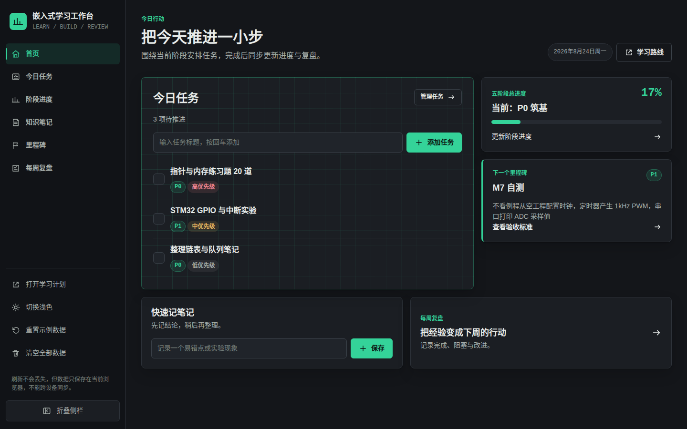
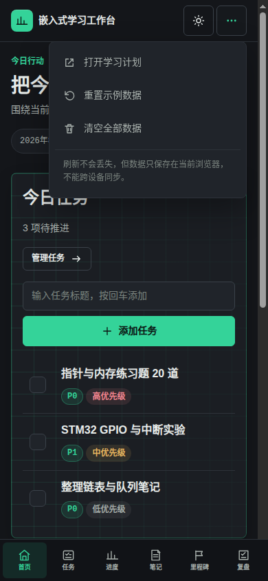

# 嵌入式学习工作台

一个配合《嵌入式学习计划》使用的本地优先学习管理工作台，面向希望系统学习嵌入式软件开发的自动化专业学生。

## About

工作台把 12–18 个月的学习路线拆成可以每天执行和每周复盘的任务，覆盖：

- C 语言、数据结构与电路基础
- 51 单片机与 STM32 外设开发
- FreeRTOS 与嵌入式 C 工程化
- 嵌入式 Linux 应用与驱动方向
- 工程拓展、综合项目、竞赛与求职准备

## 功能

- **首页**：今日任务、五阶段总进度、下一个里程碑和快速记录
- **今日任务**：新增、编辑、删除、勾选完成、按阶段和优先级筛选
- **阶段进度**：P0–P4 进度调整、下一步行动、关联任务和笔记统计
- **知识笔记**：按 C 语言、STM32、RTOS、Linux、电路等分类记录
- **里程碑自测**：M2、M7、M9、M13、M18 检查点及当前目标
- **每周复盘**：记录本周完成、阻塞点和下周改进
- **响应式界面**：支持桌面侧栏、平板图标栏和手机底部导航
- **深浅主题**：默认深色专注主题，可一键切换浅色主题

## 使用

直接打开 [`index.html`](./index.html) 即可使用，也可以访问在线版本：

<https://junhua-ecjtu.github.io/embedded-learning-workbench/>

工作台中的“学习路线”入口会打开 [`嵌入式学习计划.html`](./嵌入式学习计划.html)。

### 快速上手

1. 打开首页，在“今日任务”输入今天准备完成的学习动作，按回车或点击“添加任务”。
2. 用复选框标记完成；任务可以设置优先级和所属阶段，也可以在“今日任务”页面筛选。
3. 进入“阶段进度”，拖动进度条或使用加减按钮更新 P0–P4，并保存每个阶段的下一步行动。
4. 在“知识笔记”中选择分类，记录一个结论、实验现象或易错点。
5. 到达 M2、M7、M9、M13、M18 的验收标准后，在“里程碑自测”中标记通过。
6. 每周结束进入“每周复盘”，填写完成情况、阻塞点和下周调整。

### 页面示意

桌面首页集中展示今天要做的事、五阶段总进度和下一个里程碑：

手机端通过底部导航切换页面，右上角设置菜单可以打开学习计划、重置示例数据或清空数据：

截图来自当前 GitHub Pages 版本，实际数据和主题状态会保存在你的浏览器中。

## 数据说明

- 数据通过浏览器 `localStorage` 保存在当前设备和当前浏览器中。
- 刷新或关闭页面不会丢失数据。
- 数据不会自动上传，也不能跨设备同步。
- 侧栏或手机端设置菜单可以重置示例数据或清空全部工作台数据。

## 文件

- `index.html`：学习工作台主页面
- `嵌入式学习计划.html`：完整的嵌入式学习路线与参考资料页面

## 部署

本项目是纯 HTML、CSS 和原生 JavaScript，无需构建工具或后端。放到任意静态托管服务即可部署；当前版本使用 GitHub Pages 发布。
